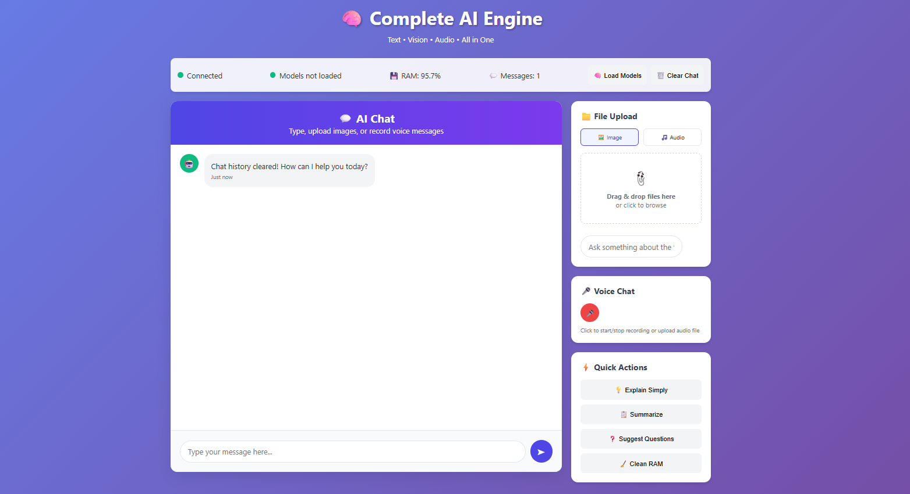

# 🎧 EchoLens: Multimodal Conversational AI Engine



**EchoLens** is a powerful multimodal AI application that brings together **text**, **image**, and **audio** inputs to create an intelligent, voice-enabled assistant. It supports conversational memory, vision-language reasoning, speech-to-text (Whisper), and text-to-speech (pyttsx3), all wrapped in a simple API interface.

---

## ✨ Features

- 🧠 **Text Chat**: Natural language conversation with memory and context support.
- 🖼️ **Image Understanding**: Upload an image with a question and get a detailed AI response using a vision-language model.
- 🎤 **Speech-to-Text**: Upload audio and transcribe it into text using OpenAI's Whisper model.
- 🔊 **Text-to-Speech**: Convert text responses into natural speech audio with pyttsx3.
- 🗣️ **Voice Conversations**: Complete pipeline for voice interaction (speech → AI → speech).
- 💾 **Persistent Memory**: Save conversation history in a JSON file.
- 🧹 **Smart RAM Management**: Auto cleanup with RAM usage tracking.
- 🌐 **Web Interface**: Basic static web UI with `/web` endpoint.

---

## 🚀 Getting Started

### 🔧 Installation

```bash
git clone https://github.com/yourusername/echolens.git
cd echolens

# Install dependencies
pip install -r requirements.txt
```

### 🧩 Required Dependencies

- `fastapi`
- `uvicorn`
- `transformers`
- `torch`
- `Pillow`
- `psutil`
- `openai-whisper` *(optional for speech-to-text)*
- `pyttsx3` *(optional for text-to-speech)*
- `pydub` *(optional for audio file conversion)*

Install optional modules only if needed:
```bash
pip install openai-whisper pyttsx3 pydub
```

---

## 🧠 Load Models

Before using the API endpoints, load all models:

```http
POST /load_models
```

This loads:
- **SmolVLM-256M-Instruct** for vision-language tasks
- **Whisper** (if available) for speech-to-text
- **pyttsx3** (if available) for text-to-speech

---

## 🧪 API Endpoints

| Endpoint | Description |
|----------|-------------|
| `GET /` | Home route with feature summary |
| `POST /load_models` | Load all AI models |
| `POST /chat` | Text chat with optional memory |
| `POST /analyze_image` | Upload an image and get a vision-language response |
| `POST /transcribe_audio` | Upload audio and get transcribed text |
| `POST /text_to_speech` | Convert text to speech and get audio |
| `POST /voice_conversation` | Full voice → text → AI → voice pipeline |
| `GET /web` | Serve basic web interface |
| `POST /clear_memory` | Clear saved conversation history |
| `GET /conversation` | View current conversation memory |
| `POST /force_cleanup` | Manually trigger RAM cleanup |
| `DELETE /cleanup_audio_files` | Delete temporary audio files |

---

## 🖼️ Sample Request

### Chat Request

```http
POST /chat
Content-Type: application/json

{
  "text": "What is the capital of France?",
  "remember": true
}
```

---

## 🧠 Memory & Cleanup

- Conversation history saved in: `conversation_history.json`
- Temporary audio files saved in: `temp_audio/`
- RAM cleanup triggered automatically after requests or manually via `/force_cleanup`

---

## 🖥️ Running the Server

```bash
uvicorn img_txt_audio_app:app --reload
```

- Access: `http://127.0.0.1:8000`
- Web UI: `http://127.0.0.1:8000/web`

---

## 📂 Project Structure

```
.
├── img_txt_audio_app.py       # Main FastAPI app
├── conversation_history.json  # Persistent conversation memory
├── temp_audio/                # Audio file storage
├── ai_web_interface.html      # Optional web UI
└── requirements.txt
```

---

## 📄 License

MIT License © [Your Name]

---

## 🙌 Acknowledgements

- [SmolVLM](https://huggingface.co/HuggingFaceTB/SmolVLM-256M-Instruct)
- [OpenAI Whisper](https://github.com/openai/whisper)
- [pyttsx3](https://github.com/nateshmbhat/pyttsx3)

---

## 🗣️ Contribute or Suggest Features

If you'd like to contribute, suggest improvements, or request features, feel free to open an issue or pull request.

---

**EchoLens** – Making AI multimodal, memory-aware, and voice-interactive 🚀
